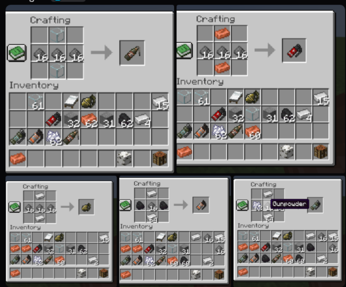

<p align="center"></p>

<div align="center">
    


|  |  |  |  |  | 
|:--------------------------------------------------------------------------------|:--------------------------------------------------------------------------------------|:--------------------------------------------------------------------------------|:-----------------------------------------------------------------------------------------|:---------------------------------------------------------------------------|:---------------------------------------------------------------------------|

This mod provides utilities in CS2(with smoke falling mechanics) to Minecraft

# Counter Strike Grenade

</div>


## Features
- [x] HE Grenades
- [x] Flash Bang
- [x] Incendiary (Molotov)
    - [x] Different varaints based on team
    - [x] Interaction with Smoke Grenades
- [x] Smoke Grenade
- [x] Decoy

## Todos
- [ ] 3D Models

## Recipes
<p align="center"></p>

## Advanced Usage
### Custom Decoy Sounds
You can make a Decoy Grenade play a specific sound using NBT tags when giving the item. This is useful for map-making and custom scenarios.

Use the `/give` command and add a `DecoySound` tag with the resource location of the desired sound.

**Example:**
To give yourself a decoy grenade that plays a creeper priming sound:
```
/give @p csgrenades:decoy{DecoySound:"minecraft:entity.creeper.primed"} 1
```
If the `DecoySound` tag is not provided, the decoy will play mob sounds by default.

## Config
In version `1.2.*` or later, you can customize this mod's behavior via [Forge's server side config](https://docs.minecraftforge.net/en/1.20.1/misc/config/#registering-a-configuration).

Config file for this mod is named `csgrenade-server.toml` under `saves/<save name>/serverconfig` folder

Below is the default one
```toml
#Configs for Counter Strike Grenade
#Configs are separated into different scopes based on the type of grenade
#Should grenade entities fly through barrier block?
ignore_barrier_block = false
#Throw cooldown, in milliseconds
#Range: 0 ~ 60000
grenade_throw_cooldown = 1000
#Throw speed when using primary button (left click by default)
#Range: 0.0 ~ 10.0
throw_speed_strong = 1.3
#Throw speed when using secondary button (right click by default)
#Range: 0.0 ~ 10.0
throw_speed_weak = 0.4
#Throw speed when using holding both button at the same time
#Range: 0.0 ~ 10.0
throw_speed_moderate = 1.0
#Range: 0.0 ~ 10.0
player_speed_factor_strong = 1.3
#Range: 0.0 ~ 10.0
player_speed_factor_weak = 0.5
#Transient time for throw type, in milliseconds
#Range: 0 ~ 60000
throw_type_transient_time = 1000
#Range: 0.0 ~ 1.0
fov_effect_amount = 0.12
#Damage living entities other than player
damage_non_player_entity = true

[SmokeGrenade]
	#Smoke radius, in block
	#Range: 2 ~ 10
	smoke_radius = 6
	#Range: 0 ~ 10000
	fuse_time_after_landing = 500
	#Range: 0 ~ 60000
	smoke_lifetime = 20000
	#Range: 0 ~ 10000
	time_before_regenerate = 1000
	#Range: 0 ~ 10000
	regeneration_time = 3000
	#Range: 0 ~ 100
	smoke_max_falling_height = 8
	#The radius of smoke cleared by a passing arrow, in blocks.
	#Range: 0.1 ~ 10.0
	arrow_clear_range = 1.2
	#The radius of smoke cleared by a passing bullet (e.g. from Tacz), in blocks.
	#Range: 0.1 ~ 10.0
	bullet_clear_range = 1.0

[HEGrenade]
	#HE grenade's damage follow a linear decay function
	#Range: 0.0 ~ 100.0
	base_damage = 30.0
	#Range: 0.0 ~ 100.0
	damage_range = 5.0
	#Range: 0.0 ~ 100.0
	head_damage_boost = 1.5
	#Allowed values: NEVER, NOT_IN_TEAM, ALWAYS
	causeDamageToOwner = "ALWAYS"

[FireGrenade]
	#Range: 0 ~ 100
	fire_range = 6
	#Lifetime of the fire, in milliseconds
	#Range: 0 ~ 100000
	lifetime = 7000
	#Fuse time before air explode, in milliseconds
	#Range: 0 ~ 100000
	fuse_time = 2000
	#Range: 0 ~ 100
	fire_extinguish_range = 6
	#Range: 0 ~ 100
	fire_max_spread_downward = 10
	#Range: 0.0 ~ 100.0
	damage = 3.0
	#In what time should fire damage reach its maximum damage (linearly)
	#Range: 0 ~ 100000
	damage_increase_time = 2000
	#Allowed values: NEVER, NOT_IN_TEAM, ALWAYS
	causeDamageToOwner = "ALWAYS"
```

## Commands
This mod provides server-side commands to configure grenade behavior in-game. You must have operator permissions (level 2) to use them.

### Set Self-Damage Policy
You can control whether HE grenades and fire grenades (Incendiary/Molotov) can damage their owner.

**Usage:**
`/csgrenades <grenadeType> causeDamageToOwner <value>`

-   `<grenadeType>`: The type of grenade to configure.
    -   `hegrenade`
    -   `firegrenade`
-   `<value>`: The self-damage policy.
    -   `always`: Grenades will always damage their owner. (Default)
    -   `not_in_team`: Grenades will only damage their owner if team-based friendly fire is enabled.
    -   `never`: Grenades will never damage their owner.

**Example:**
`/csgrenades hegrenade causeDamageToOwner never`

### Set Global Settings
You can configure global settings that affect all grenades.

**Usage:**
`/csgrenades global <setting> <value>`

-   `<setting>`: The global setting to change.
    -   `ignoreBarrierBlock`: Controls if grenades pass through barrier blocks.
-   `<value>`: The value for the setting.
    -   `true`: Grenades will fly through barrier blocks.
    -   `false`: Grenades will collide with barrier blocks. (Default)

**Example:**
`/csgrenades global ignoreBarrierBlock true`

## Localization
The mod currently supports the following languages:
-   English (en_us)
-   简体中文 (zh_cn)

## Acknowledgments
- [MinecraftForge/MinecraftForge: Modifications to the Minecraft base files to assist in compatibility between mods](https://github.com/MinecraftForge/MinecraftForge)
- [thedarkcolour/KotlinForForge: Makes Kotlin forge-friendly.](https://github.com/thedarkcolour/KotlinForForge)
- CI/CD
  - [cloudnode-pro/modrinth-publish: A GitHub Action for publishing plugin versions to Modrinth](https://github.com/cloudnode-pro/modrinth-publish)

## Contributor
- Programm: [@yurinekoai](https://github.com/yurinekoai)
- Assets: [@Dragonzhi](https://github.com/Dragonzhi)
