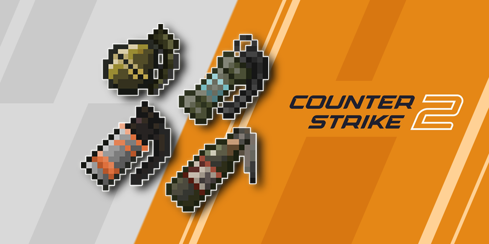

<p align="center"></p>

<div align="center">
    


|  |  |  |  |  
|:--------------------------------------------------------------------------------|:--------------------------------------------------------------------------------------|:--------------------------------------------------------------------------------|:-----------------------------------------------------------------------------------------|:---------------------------------------------------------------------------|

This mod provides utilities in CS2(with smoke falling mechanics) to Minecraft

# Counter Strike Grenade

</div>


## Features
- [x] HE Grenades
- [x] Flash Bang
- [x] Incendiary (Molotov)
    - [x] Different varaints based on team
    - [x] Interaction with Smoke Grenades
- [x] Smoke Grenade


## Todos
- [ ] Decoy
- [ ] 3D Models

## Config
In version `1.2.*` or later, you can customize this mod's behavior via [Forge's server side config](https://docs.minecraftforge.net/en/1.20.1/misc/config/#registering-a-configuration).

Config file for this mod is named `csgrenade-server.toml` under `serverconfig` folder

Below is the default one
```toml
#Configs for Counter Strike Grenade
#Configs are separated into different scopes based on the type of grenade
ignore_barrier_block = false
#Range: 0 ~ 60000
grenade_throw_cooldown = 1000
#Range: 0.0 ~ 10.0
throw_speed_strong = 1.3
#Range: 0.0 ~ 10.0
throw_speed_weak = 0.4
#Range: 0.0 ~ 10.0
throw_speed_moderate = 1.0
#Range: 0.0 ~ 10.0
player_speed_factor_strong = 1.3
#Range: 0.0 ~ 10.0
player_speed_factor_weak = 0.5
#Range: 0 ~ 60000
throw_type_transient_time = 1000
#Range: 0.0 ~ 1.0
fov_effect_amount = 0.12

[SmokeGrenade]
	#Range: 2 ~ 10
	smoke_radius = 6
	#Range: 0.0 ~ 10.0
	fuse_time_after_landing = 0.5
	#Range: 0 ~ 60000
	smoke_lifetime = 20000
	#Range: 0.0 ~ 10000.0
	time_before_regenerate = 1000.0
	#Range: 0.0 ~ 10000.0
	regeneration_time = 3000.0
	#Range: 0 ~ 100
	smoke_max_falling_height = 30

[HEGrenade]
	#Range: 0.0 ~ 100.0
	base_damage = 30.0
	#Range: 0.0 ~ 100.0
	damage_range = 5.0

[FireGrenade]
	#Range: 0 ~ 100
	fire_range = 6
	#Range: 0 ~ 100000
	lifetime = 7000
	#Range: 0 ~ 100000
	fuse_time = 2000
	#Range: 0 ~ 100
	fire_extinguish_range = 6
	#Range: 0 ~ 100
	fire_max_spread_downward = 10
```

## Acknowledgments
- [MinecraftForge/MinecraftForge: Modifications to the Minecraft base files to assist in compatibility between mods](https://github.com/MinecraftForge/MinecraftForge)
- [thedarkcolour/KotlinForForge: Makes Kotlin forge-friendly.](https://github.com/thedarkcolour/KotlinForForge)
