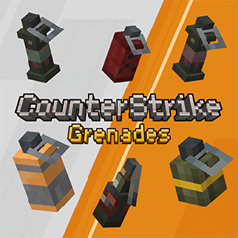

    

|  |  |  |  |  
|:--------------------------------------------------------------------------------|:--------------------------------------------------------------------------------------|:--------------------------------------------------------------------------------|:-----------------------------------------------------------------------------------------|:---------------------------------------------------------------------------|

This mod provides utilities in CS2(with smoke falling mechanics) to Minecraft

# Counter Strike Grenade

## Features
- [x] HE Grenades
- [x] Flash Bang
- [x] Incendiary (Molotov)
    - [x] Different varaints based on team
    - [x] Interaction with Smoke Grenades
- [x] Smoke Grenade

Showcase: [YouTube](https://www.youtube.com/watch?v=wpVh0Wzt4uQ)

## Todos
- [ ] Decoy
- [ ] 3D Models

## Acknowledgments
- [MinecraftForge/MinecraftForge: Modifications to the Minecraft base files to assist in compatibility between mods](https://github.com/MinecraftForge/MinecraftForge)
- [thedarkcolour/KotlinForForge: Makes Kotlin forge-friendly.](https://github.com/thedarkcolour/KotlinForForge)
